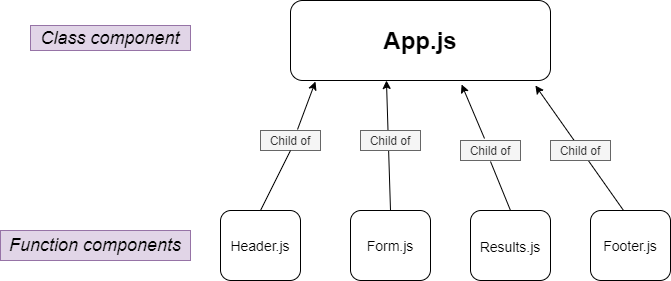

# Lab: Class 26

## RESTy-API(Component Based UI)

### Author: Razan Alamleh

### Code Sandbox
- [Sandbox](https://codesandbox.io/s/currying-frog-9ml5y)

### Running the app
- npm start

### UML

### Pull request
[PR](https://github.com/Razan-am/RESTy-API/pull/1)

---------------------------------------------------------------------------------------

# Lab: Class 27

## RESTy-API(`useState()` Hook)

### Author: Razan Alamleh

### Code Sandbox
- [Sandbox](https://codesandbox.io/s/elated-mendel-1hvmp)
### GitHub action
- [GitHub action](https://github.com/Razan-am/RESTy-API/runs/3588175938?check_suite_focus=true)

### Running the app
- npm start

### UML

### Pull request
[PR](https://github.com/Razan-am/RESTy-API/pull/3)

---------------------------------------------------------------------------------------

# Lab: Class 28

## RESTy-API(Component Lifecycle / `useEffect()` Hook)

### Author: Razan Alamleh

### Code Sandbox
- [Sandbox](https://codesandbox.io/s/sad-galileo-gb98i)
### GitHub action
- [GitHub action](https://github.com/Razan-am/RESTy-API/runs/3588175938?check_suite_focus=true)

### Running the app
- npm start

### UML

### Pull request
[PR](https://github.com/Razan-am/RESTy-API/pull/4)
